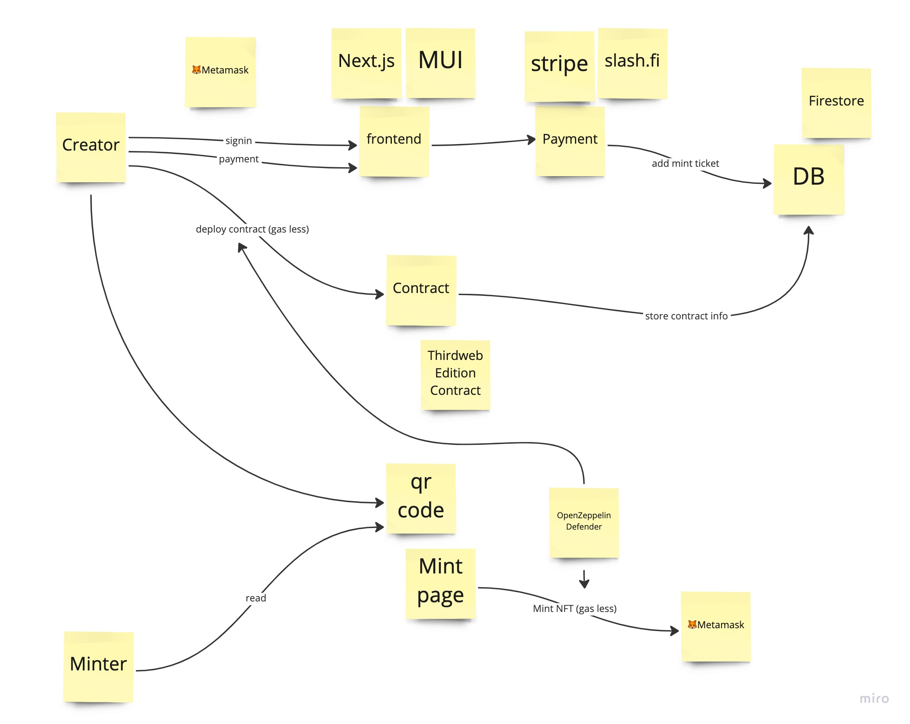

# Omiyage NFT

## 使用した tech stacks

- BlockChain Related
  - Thirdweb
    - Edition Contract (ERC1155)
  - OpenZepellin Defender
    - Relayer
    - Auto task
- Frontend
  - Next.js
  - MUI
  - Thirdweb-sdk
  - Google Maps API
- DB
  - Firestore
- Backend
  - Twitter API
  - Moralis API
- Payment
  - Stripe
  - Slash.fi

### Architecture

## 使用した Blockchain

- Goerli
- Mumbai
- 今後は Thirdweb と OpenZeppelin が対応しているチェーン全てに対応予定です
  - Ethereum
  - Polygon
  - Avalanche
  - Optimism
  - Arbitrum
  - BSC
  - Fantom

## deploy した Contract

- none
- 今後 NFT 配布ツールは増えていくと思いますが、コントラクトは独自のものを使わず、監査されたものを使うべき＋ユーザーに主権があるものを使うべきという思想のもと、Thirdweb のコントラクトを使用しました

## 審査やテストのためにプロジェクトにアクセスする方法など

https://omiyage-nft.vercel.app/
